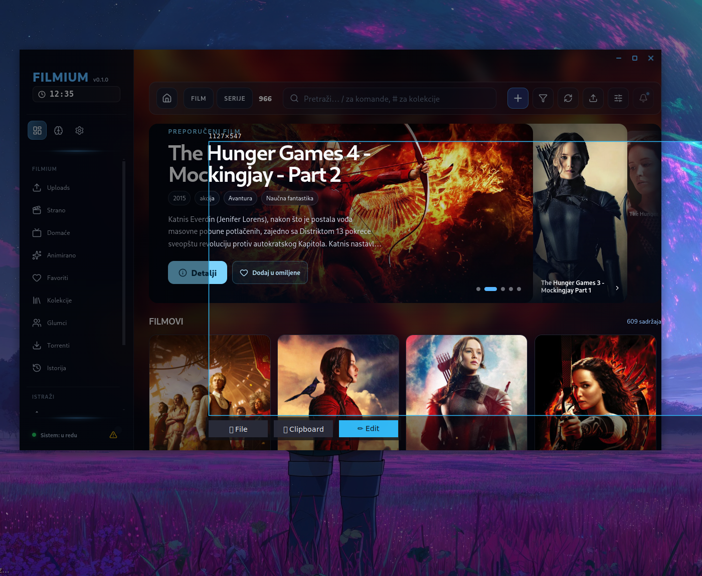
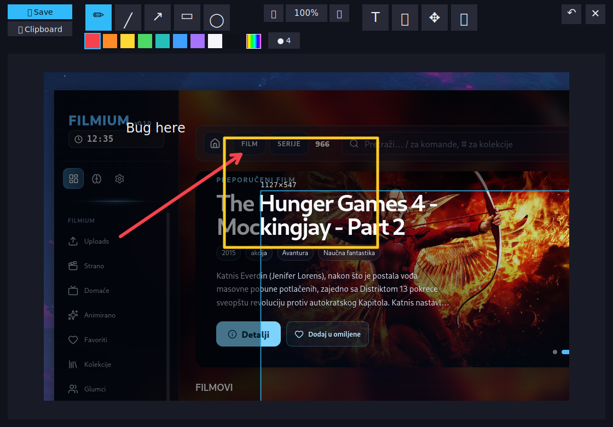
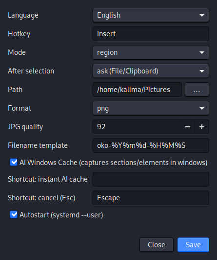

# OKO — Screenshot & Annotation Daemon

**OKO** is a lightweight background GTK3 application for Linux that captures the
screen, a window, or a hand-drawn region, and lets you annotate the result in a
built-in editor before saving it to a file or the clipboard. It is triggered by a
global hotkey (default **Insert**) and exposes a small local HTTP API (`:4807`) so
other tools can drive it programmatically.

The interface is available in **English (default)** and **Serbian**, switchable in
Settings and remembered automatically.

---

## What it looks like

### 1. Region selection
Press **Insert** to freeze the screen and drag a rectangle. Quick actions appear next
to the selection: **File**, **Clipboard**, or **Edit** (open the annotation editor).



### 2. Annotation editor
A centered, translucent editor. Tools: pen, line, arrow, rectangle, ellipse, text,
crop, move, pan. A color palette plus a full-spectrum color picker, adjustable line
width, **zoom** (mouse-wheel at cursor, buttons, pan), **crop**, and **region
copy/paste** as a movable object (`Ctrl+C` / `Ctrl+V`). `Ctrl+Z` undoes. Save to a
**File** or the **Clipboard**; the output is rendered at the original resolution.



### 3. Settings
Native settings window (also available as a web page at `http://127.0.0.1:4807/`).
Language, hotkey, default mode, action after selection, save path, format/quality,
filename template, **AI Windows Cache** (capture sections/elements inside our apps),
shortcuts, and autostart. Changes apply immediately and are persisted.



---

## How it works

- A background **daemon** grabs the global hotkey via X11 (`python-xlib`) and locates
  the active window with `xdotool`.
- Screen pixels are captured, cropped, saved, or copied natively through **GTK3 /
  GdkPixbuf / cairo** — no external screenshot tool is required at capture time.
- **AI Windows Cache:** when the focused window is one of our own `cell-shell` apps,
  OKO offers a DOM element/section picker (the app returns a rectangle over a small
  long-poll IPC channel; OKO crops it).
- **IPC** (`127.0.0.1:4807`) is the programmatic interface: `POST /capture`,
  `GET /health`, `GET /last`, `GET|POST /settings`, and the `/pick/*` routes.
- **Single instance:** a lock file prevents two daemons from grabbing the hotkey.

---

## Supported system

- **OS:** Linux with an **X11 (Xorg)** session and **GTK 3**. Uses `XGrabKey` and
  `xdotool`, so a pure **Wayland** session is not supported (use an Xorg session).
- **Developed and tested on:** Kali GNU/Linux Rolling **2026.3** (kernel
  `7.1.5+kali-amd64`, x86-64). Should run on any modern Debian/Ubuntu-based X11 system.
- **Python:** 3.10+.

---

## Dependencies

**System packages (APT):**

| Package | Why |
|---|---|
| `python3` (≥3.10) | runtime |
| `python3-gi` | Python GObject bindings (GTK) |
| `gir1.2-gtk-3.0` | GTK 3 typelib |
| `xdotool` | active-window geometry / PID |
| `policykit-1` (`pkexec`) | used by the launcher's **INSTALL** button (optional) |
| `zenity` | optional dialog fallback |

**Python packages (installed into a local `venv`):**

| Package | Why |
|---|---|
| `python-xlib` (≥0.33) | global hotkey via X11 |

The virtual environment is created with `--system-site-packages`, so `gi`/GTK are used
from the system (not reinstalled by pip).

---

## Install (local machine)

```bash
# 1) system packages
sudo apt-get update
sudo apt-get install -y python3 python3-gi gir1.2-gtk-3.0 xdotool

# 2) get OKO and launch — the launcher creates the venv,
#    installs python-xlib, and starts the daemon
cd ~/ai/APPS/utilities/oko
./oko.sh
```

On launch, `oko.sh` runs `scripts/check_deps.sh`. If a system package is missing it
shows a small dialog with a **copy-paste command** and an **INSTALL** button
(`pkexec apt-get …`); it then creates the `.venv` and installs `python-xlib`
automatically.

**Double-click launch:** install the desktop entry so OKO starts on double-click:

```bash
cp OKO.desktop ~/.local/share/applications/
cp OKO.desktop ~/Desktop/
update-desktop-database ~/.local/share/applications 2>/dev/null || true
```

**Autostart (optional, systemd user service):**

```bash
mkdir -p ~/.config/systemd/user
cp service/oko.service ~/.config/systemd/user/
systemctl --user daemon-reload
systemctl --user enable --now oko.service
```

---

## Usage

- **Insert** → region selection → **File / Clipboard / Edit** (or keys `Enter`=File,
  `C`=Clipboard, `E`=Edit, `Esc`=cancel).
- Tray icon → capture region/window/screen, Settings, Quit.
- Programmatic capture (used by `commit_shots.py`):

```bash
curl -s -X POST 127.0.0.1:4807/capture \
  -H 'Content-Type: application/json' \
  -d '{"mode":"window","dest":"file","path":"/tmp/x.png","interactive":false}'
```

See the top-level [`README.md`](../README.md) for the full command reference.
